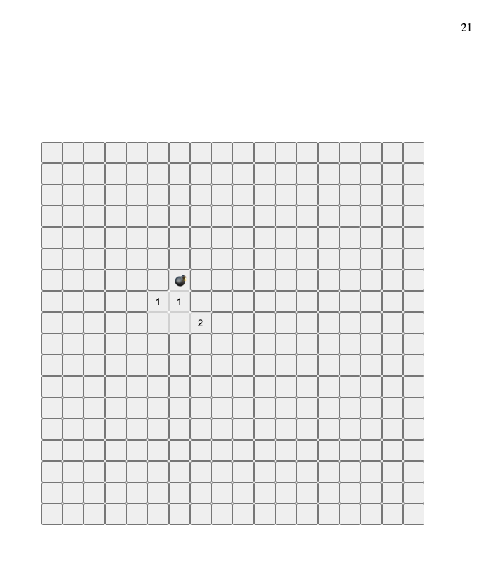

# Mine Sweeper:

This is a re make of the once popular game "Mine Sweeper". it uses HTML, CSS, and JavaScript to run the game. Most of the code is in JavaScript with HTML providing a template to add to in the script. 

## Description & Instructions:
Playing the game takes users to a screen where they are prompted to start the game and upon clicking, they start. 

The game is a set of buttons, all associated with a value, either 0-5 or bomb. The number represents the number of bombs in the immediate region of the clicked tile. 

If a player clicks on a tile with a bomb, the game ends and the player can restart to try again.

The aim of the game is to uncover all tiles without bombs under them, and never click on a tile that does contain a bomb.

## Play the game!
The game is hosted at  https://evancwoods.github.io/mineSweeper/ Have Fun!

## Future Develepments:
This Version of the game does not have the traditional large scale clearing on the first click but in the future it will be implamented.